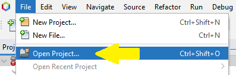

# Simulador de procesos - S.O. - Equipo I
Matias Cabrera, Juan Maidana, Gonzalo Da Silva

# ¿Como ejecutar nuestro programa? 
<h2>Software necesario:</h2>
- Apache Net Beans IDE 13 <a href="https://netbeans.apache.org/download/nb13/nb13.html">Link de descarga</a>
  
- JDK (x64) <a href="https://www.oracle.com/java/technologies/downloads/#jdk18-windows">Link de descarga</a> 

<h2>Procedimiento:</h2>

- Instalar correctamente el Apache Net Beans IDE 13, al instalarlo te solicitara la ubicacion del JDK previamente descargado.
- Una vez realizada la instalacion, descargar el repositorio en tu dispositivo
- Dentro del Net Beans, hacemos click donde dice "Open proyect" Como muestra la imagen 

- y seleccionamos el repositorio ya descargado. 
- Para poder ejecutar el programa seleccionamos el siguiente boton  

